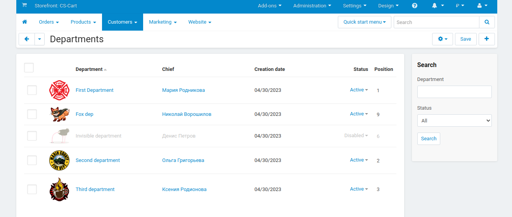
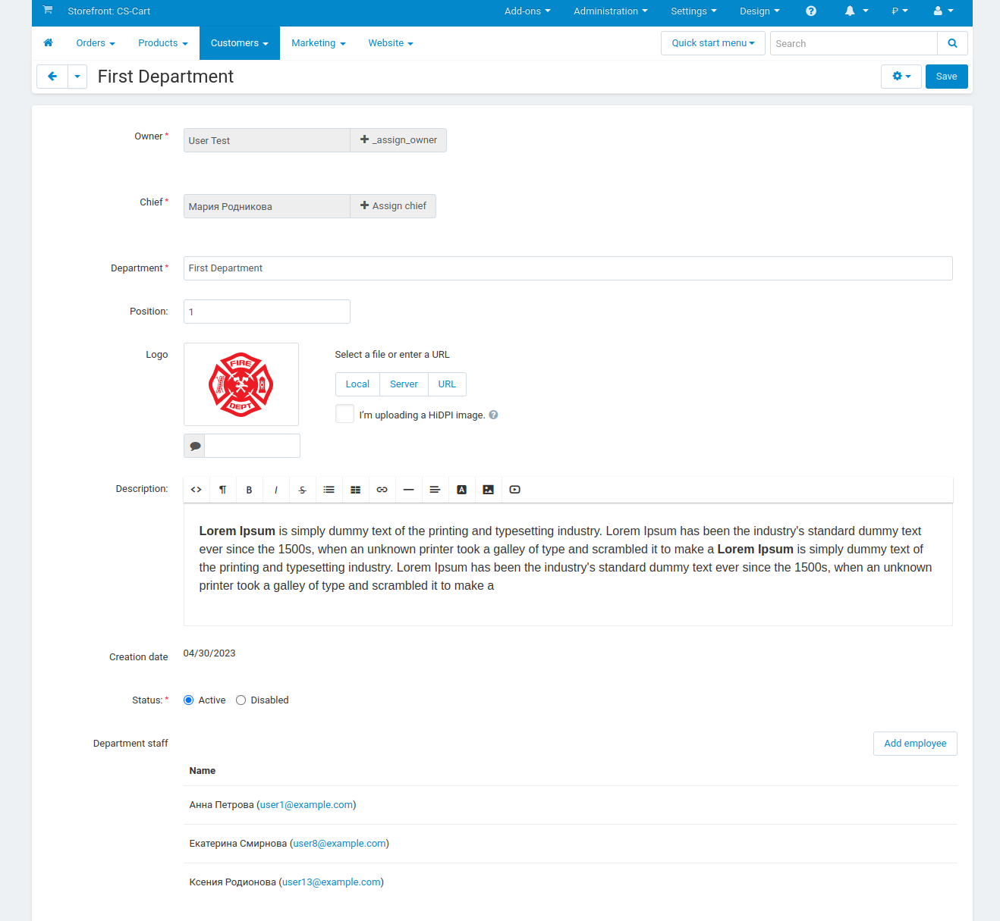
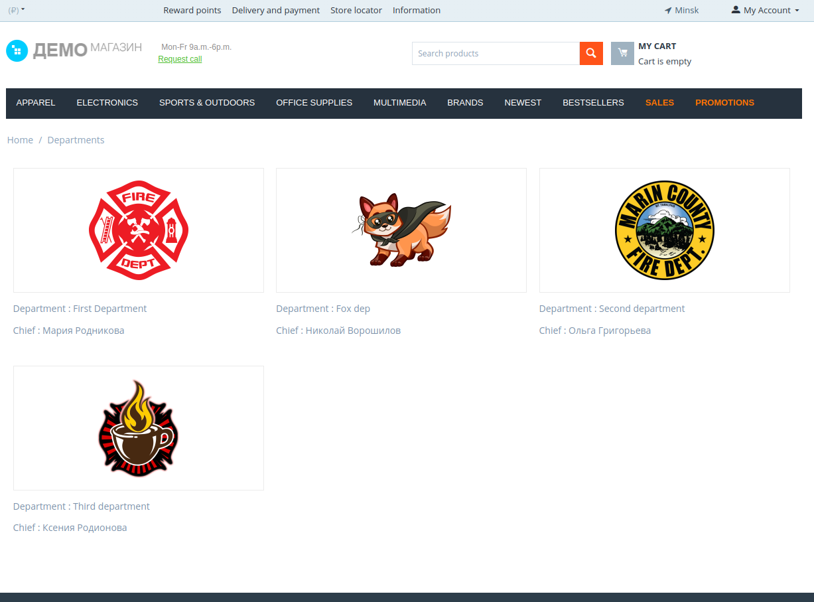

# List of departments based on CS-Cart. New CS-Cart module

> New module departments in CS-Cart. 


---

[Description](#description) •
[Project setup](#project-setup) •
[Features](#features) •
[Project Status](#project-status) •
[Contact](#contact)






## Description

Pages with a list of departments and a department card + interface for managing the list of departments based on CS-Cart (eCommerce marketplace software).

## Project setup

- Clone this repo to your desktop.
- Сonfigure administration tool for MySQL according to his instructions.
> - To populate with bd testsfake data import the file [simtechdev_departments_store.sql](../var/mydb/simtechdev_departments_store.sql) to MySQL bd (For example ```import -> Imported file``` in phpMyAdmin).
> - To add empty tables entity departments using sql queries from a file [departments_store.sql](../var//mydb/departments_store.sql). In phpMyAdmin choose ```simtechdev_departments``` table and inser in SQL tab queries.
> - To populate with bd testsfake data (with departments) import the file [simtechdev_departments_with_departments.sql](../var/mydb/simtechdev_departments_with_departments.sql) to MySQL bd (For example ```import -> Imported file``` in phpMyAdmin).
> - To connect the module to app go to admin panel and activate modules `Departments` in the tab ```Add-ons```.
- To access the admin panel:
``` 
    login:    admin@example.com
    possword: admin
```
- test user in shop: 
``` 
    login:    testUser@test.com
    possword: test$1user
```

## Features
- New addon in CS-Cart.
- Implemented creation a new entity 'departments' in the admin panel.
- Implemented display a new entity 'departments' in the store panel.
- Testing with Codeception.

## Project Status

Project is: *in progress*

## Contact
Created by [@RimidalU](https://www.linkedin.com/in/uladzimir-stankevich/) - feel free to contact me!

<p align="right"><a href="#start"></a></p>